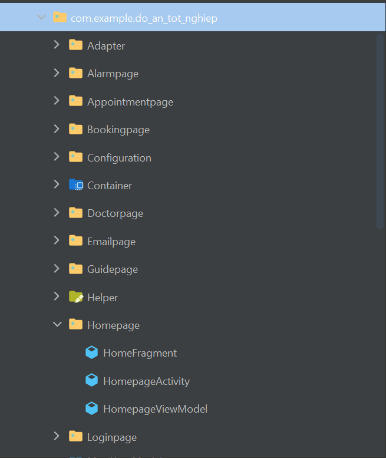
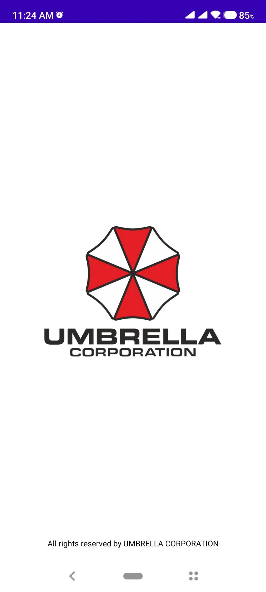

<h1 align="center">Đồ án tốt nghiệp - Học viện Công nghệ Bưu chính viễn thông  
    Ứng dụng Android hỗ trợ bệnh nhân đăng ký khám và điều trị bệnh 
</h1>

    

# [**Table Of Content**](#table-of-content)
- [**Table Of Content**](#table-of-content)
- [**Introduction**](#introduction)
- [**Topic**](#topic)
- [**API Document**](#api-document)
- [**Database**](#database)
- [**Directory Structure**](#directory-structure)
- [**Features**](#features)
  - [**1. Launch**](#1-launch)
- [**Made with 💘 and Android**](#made-with--and-android)
# [**Introduction**](#introduction)

Chào các bạn, mình tên là Nguyễn Thành Phong. 
Mã số N18DCCN147. 
Niên khóa 2018-2023. 

Lời đầu tiên mình xin chào các bạn và cảm ơn tất cả các bạn đang ở đây. Trong tài liệu này mình sẽ chia sẻ tất cả những gì các bạn cần biết khi làm đồ án 
tốt nghiệp và đề tài do mình thực hiện để các bạn có thể tham khảo. Mình hi vọng phần tài liệu mình viết tiếp theo đây 
sẽ hỗ trợ phần nào cho các bạn khi bước tới ngưỡng cửa quan trọng của cuộc đời mình - tốt nghiệp đại học.

Đồ án tốt nghiệp này có tất cả là 3 thành phần bao gồm:

* [**API**](https://github.com/Phong-Kaster/PTIT-Do-An-Tot-Nghiep) 
  
* [**Website**](https://github.com/Phong-Kaster/PTIT-Do-An-Tot-Nghiep-Website)
  
* [**Ứng dụng Android**](#) (Hiện tại)

Các bạn đang đọc phần mô tả chi tiết về `ứng dụng Android` trong đoán này trong tài liệu này mình sẽ mô tả chi tiết về cấu trúc của các thư mục các tính năng nổi bật nhất và một số những cái lưu ý khi các bạn tham khảo đồ án này.

# [**Topic**](#topic)

    

Có thể giải thích yêu cầu đề tài ngắn gọn như sau:

**Website** - Đóng vai trò là ứng dụng quản trị viên. Hỗ trợ bệnh viện quản lý thông tin bác sĩ & bệnh nhân,
sắp xếp lịch khám bệnh giữa bác sĩ và bệnh nhân.

**Android** - Ứng dụng để bệnh nhân đặt lịch khám bệnh, theo dõi phác đồ điều trị và bệnh án của mình. Có thể đặt lịch khám bệnh
cho người thân trong gia đình như ông, bà, bố, mẹ & không nhất thiết người khám bệnh phải là bản thân mình.

Chúng ta sẽ cân phân tích đề tài kĩ hơn vì rất dễ gây nhầm lẫn. Cụ thể chính thầy hướng dẫn và thầy giáo 
phản biện đồ án của mình đã nghĩ thành 2 hướng khác nhau:

**Thầy Nguyễn Anh Hào - giáo viên hướng dẫn**: ứng dụng chỉ để bệnh nhân cung cấp thông tin cá nhân & rút ngắn thời gian khám bệnh. 
Vẫn có chức năng đặt lịch hẹn khám nhưng chỉ để cung cấp thông tin cá nhân, nhằm rút ngắn thời gian khám của bác sĩ. Hoạt động trên 
nguyên tắc `ai đến trước thì được khám trước`, không chấp nhận việc đặt giờ trả tiền trước để vào khám. Điều này ưu tiên 
những bệnh nhân nghèo, không thông thạo các thao tác trên di động, ưu tiên những người đã bỏ thời gian ra xếp hàng để khám bệnh.

**Thầy Huỳnh Trung Trụ - giáo viên phản biện**: ứng dụng là đặt lịch hẹn với bác sĩ. Tức cho chọn chuyên khoa, chọn bác sĩ khám bệnh trước & dĩ nhiên 
là chọn giờ khám luôn. Hoạt động trên nguyên tắc `tôi đặt lịch hẹn thì đúng giờ đó tui phải được vào khám`.

Như trên thì lý luận của 2 thầy đều đúng và Phong thì thiết kế chương trình theo giáo viên hướng dẫn của mình.👼👼👼
# [**API Document**](#api-document)

Mình có soạn thảo và liệt kê chi tiết cách sử dụng các chức năng mà mình đã xây dựng thành tài liệu.
Nếu các bạn có nhu cầu muốn tham khảo, hãy ấn vào [**đây**](https://github.com/Phong-Kaster/PTIT-Do-An-Tot-Nghiep-API-Document) để đọc chi tiết cách sử dụng API này.

# [**Database**](#database)

    

<h3 align="center">

***Sơ đồ cơ sở dữ liệu***
</h3>

# [**Directory Structure**](#directory-structure)

Đầu tiên mình sẽ giới thiệu về cấu trúc thư mục trong đồ án này. Hãy quan sát hình hình trụ bên dưới để có cái nhìn tổng quan nhất bật về toàn bộ cấu trúc của thư mục này

    

    

<h3 align="center">

***Toàn bộ cấu trúc cây thư mục trong Umbrella Health - ứng dụng Android của đề tài***
</h3>

Tên của các thư mục trong dự án này được đặt tên theo quy ước như sau:

- **Thư mục Adapter** - được sử dụng để chứa các class dùng để khai báo các List View
  
- **Các thư mục có đuôi là page** - như Homepage, Loginpage,.... được sử dụng để chứa các activity hay giao diện để người sử dụng có thể để tương tác với ứng dụng 

- **Thư mục Configuration** - được sử dụng để khai báo các biến toàn cục và và các HTTP request để sử dụng API. Ứng dụng này sử dụng thư viện `Retrofit` để liên kết với các API 

- **Thư mục Container** - được sử dụng để khai báo các định dạng JSON khi  sử dụng API.

- **Thư mục Helper** - được sử dụng để khai báo các hàm hàm public static trong nhiệm vụ làm đẹp hình thức hiển thị của dữ liệu

- **Thư mục Model** - tương tự như vai trò của model trong mô hình mvc, thư mục chứa các khai báo về đối tượng xuất hiện trong phần mô tả database ở phía trên. 

- **Thư mục Recycler View** -  tập hợp tất cả các các recycler view được sử dụng trong dự án này 

- **Thư mục Repository** - là thư mục tập hợp tất cả các các khai báo để gọi các API tương ứng

- **MainActivity & MainViewModel** - sẽ là activity đầu tiên được khởi chạy khi mở ứng dụng này 

# [**Features**](#features)

Phần này mình sẽ giới thiệu về tất cả các giao diện và các chức năng chính trong ứng dụng Umbrella Health

## [**1. Launch**](#1-launch)

    

<h3 align="center">

***Màn hình khởi chạy khi mở ứng dụng***
</h3>

# [**Made with 💘 and Android**](#made-with-love-and-android)