<h1 align="center">Đồ án tốt nghiệp - Học viện Công nghệ Bưu chính viễn thông  
    Ứng dụng Android hỗ trợ bệnh nhân đăng ký khám và điều trị bệnh 
</h1>

    

# [**Table Of Content**](#table-of-content)
- [**Table Of Content**](#table-of-content)
- [**Introduction**](#introduction)
- [**Topic**](#topic)
- [**API Document**](#api-document)
- [**Database**](#database)
- [**Directory Structure**](#directory-structure)
- [**Major Features**](#major-features)
  - [**1. Launch**](#1-launch)
  - [**2. Login**](#2-login)
  - [**3. Home**](#3-home)
  - [**4. Appointment**](#4-appointment)
  - [**5. Treatment \& Record**](#5-treatment--record)
  - [**6. Reminder**](#6-reminder)
  - [**7. Booking**](#7-booking)
  - [**8. Notification**](#8-notification)
- [**Minor Features**](#minor-features)
  - [**1. About Us**](#1-about-us)
  - [**2. Appointment history \& Booking history**](#2-appointment-history--booking-history)
  - [**3. Reminder**](#3-reminder)
  - [**4. Personal Information**](#4-personal-information)
  - [**5. Dark Mode**](#5-dark-mode)
  - [**6. Email**](#6-email)
  - [**7. Support Different    Languages**](#7-support-different----languages)
  - [**8. Navigation with Google Map**](#8-navigation-with-google-map)
  - [**9. Pop-up when clicking Back button**](#9-pop-up-when-clicking-back-button)
- [**Post Script**](#post-script)
- [**Made with 💘 and Android**](#made-with--and-android)
# [**Introduction**](#introduction)

Chào các bạn, mình tên là Nguyễn Thành Phong. 
Mã số N18DCCN147. 
Niên khóa 2018-2023. 

Lời đầu tiên mình xin chào các bạn và cảm ơn tất cả các bạn đang ở đây. Trong tài liệu này mình sẽ chia sẻ tất cả những gì các bạn cần biết khi làm đồ án 
tốt nghiệp và đề tài do mình thực hiện để các bạn có thể tham khảo. Mình hi vọng phần tài liệu mình viết tiếp theo đây 
sẽ hỗ trợ phần nào cho các bạn khi bước tới ngưỡng cửa quan trọng của cuộc đời mình - tốt nghiệp đại học.

Đồ án tốt nghiệp này có tất cả là 3 thành phần bao gồm:

* [**API**](https://github.com/Phong-Kaster/PTIT-Do-An-Tot-Nghiep) 
  
* [**Website**](https://github.com/Phong-Kaster/PTIT-Do-An-Tot-Nghiep-Website)
  
* [**Ứng dụng Android**](#) (Hiện tại)

Các bạn đang đọc phần mô tả chi tiết về `ứng dụng Android` trong đoán này trong tài liệu này mình sẽ mô tả chi tiết về cấu trúc của các thư mục các tính năng nổi bật nhất và một số những cái lưu ý khi các bạn tham khảo đồ án này.

# [**Topic**](#topic)

    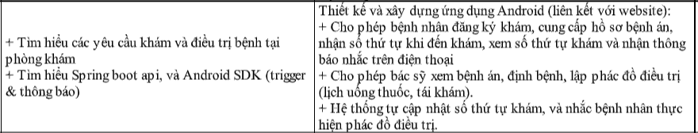

Có thể giải thích yêu cầu đề tài ngắn gọn như sau:

**Website** - Đóng vai trò là ứng dụng quản trị viên. Hỗ trợ bệnh viện quản lý thông tin bác sĩ & bệnh nhân,
sắp xếp lịch khám bệnh giữa bác sĩ và bệnh nhân.

**Android** - Ứng dụng để bệnh nhân đặt lịch khám bệnh, theo dõi phác đồ điều trị và bệnh án của mình. Có thể đặt lịch khám bệnh
cho người thân trong gia đình như ông, bà, bố, mẹ & không nhất thiết người khám bệnh phải là bản thân mình.

Chúng ta sẽ cân phân tích đề tài kĩ hơn vì rất dễ gây nhầm lẫn. Cụ thể chính thầy hướng dẫn và thầy giáo 
phản biện đồ án của mình đã nghĩ thành 2 hướng khác nhau:

**Thầy Nguyễn Anh Hào - giáo viên hướng dẫn**: ứng dụng chỉ để bệnh nhân cung cấp thông tin cá nhân & rút ngắn thời gian khám bệnh. 
Vẫn có chức năng đặt lịch hẹn khám nhưng chỉ để cung cấp thông tin cá nhân, nhằm rút ngắn thời gian khám của bác sĩ. Hoạt động trên 
nguyên tắc `ai đến trước thì được khám trước`, không chấp nhận việc đặt giờ trả tiền trước để vào khám. Điều này ưu tiên 
những bệnh nhân nghèo, không thông thạo các thao tác trên di động, ưu tiên những người đã bỏ thời gian ra xếp hàng để khám bệnh.

**Thầy Huỳnh Trung Trụ - giáo viên phản biện**: ứng dụng là đặt lịch hẹn với bác sĩ. Tức cho chọn chuyên khoa, chọn bác sĩ khám bệnh trước & dĩ nhiên 
là chọn giờ khám luôn. Hoạt động trên nguyên tắc `tôi đặt lịch hẹn thì đúng giờ đó tui phải được vào khám`.

Như trên thì lý luận của 2 thầy đều đúng và Phong thì thiết kế chương trình theo giáo viên hướng dẫn của mình.👼👼👼
# [**API Document**](#api-document)

Mình có soạn thảo và liệt kê chi tiết cách sử dụng các chức năng mà mình đã xây dựng thành tài liệu.
Nếu các bạn có nhu cầu muốn tham khảo, hãy ấn vào [**đây**](https://github.com/Phong-Kaster/PTIT-Do-An-Tot-Nghiep-API-Document) để đọc chi tiết cách sử dụng API này.

# [**Database**](#database)

    

<h3 align="center">

***Sơ đồ cơ sở dữ liệu***
</h3>

# [**Directory Structure**](#directory-structure)

Đầu tiên mình sẽ giới thiệu về cấu trúc thư mục trong đồ án này. Hãy quan sát hình hình trụ bên dưới để có cái nhìn tổng quan nhất bật về toàn bộ cấu trúc của thư mục này

    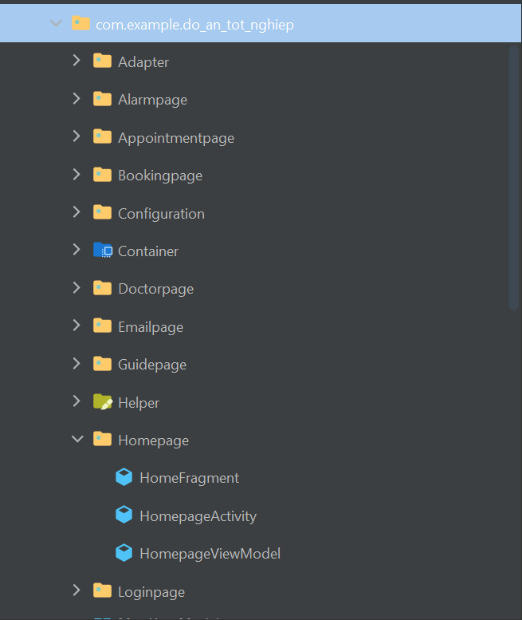

    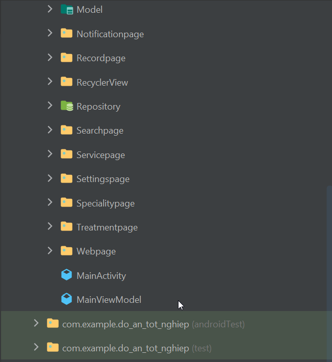

<h3 align="center">

***Toàn bộ cấu trúc cây thư mục trong Umbrella Health - ứng dụng Android của đề tài***
</h3>

Tên của các thư mục trong dự án này được đặt tên theo quy ước như sau:

- **Thư mục Adapter** - được sử dụng để chứa các class dùng để khai báo các List View
  
- **Các thư mục có đuôi là page** - như Homepage, Loginpage,.... được sử dụng để chứa các activity hay giao diện để người sử dụng có thể để tương tác với ứng dụng 

- **Thư mục Configuration** - được sử dụng để khai báo các biến toàn cục và và các HTTP request để sử dụng API. Ứng dụng này sử dụng thư viện `Retrofit` để liên kết với các API 

- **Thư mục Container** - được sử dụng để khai báo các định dạng JSON khi  sử dụng API.

- **Thư mục Helper** - được sử dụng để khai báo các hàm hàm public static trong nhiệm vụ làm đẹp hình thức hiển thị của dữ liệu

- **Thư mục Model** - tương tự như vai trò của model trong mô hình mvc, thư mục chứa các khai báo về đối tượng xuất hiện trong phần mô tả database ở phía trên. 

- **Thư mục Recycler View** -  tập hợp tất cả các các recycler view được sử dụng trong dự án này 

- **Thư mục Repository** - là thư mục tập hợp tất cả các các khai báo để gọi các API tương ứng

- **MainActivity & MainViewModel** - sẽ là activity đầu tiên được khởi chạy khi mở ứng dụng này 

# [**Major Features**](#features)

Phần này mình sẽ giới thiệu về tất cả các giao diện và các chức năng chính trong ứng dụng Umbrella Health

## [**1. Launch**](#1-launch)

    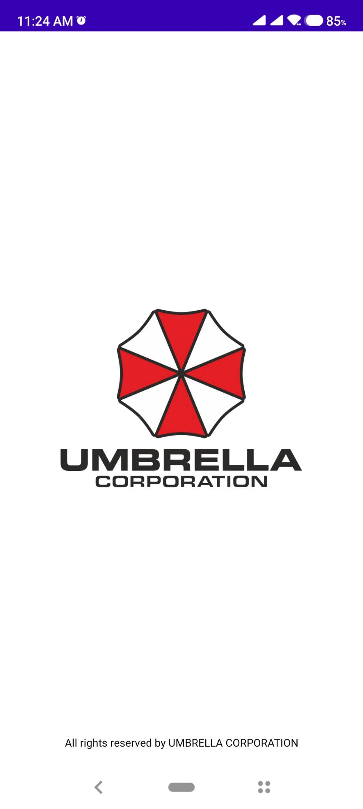

<h3 align="center">

***Màn hình khởi chạy khi mở ứng dụng***
</h3>

## [**2. Login**](#2-login)

    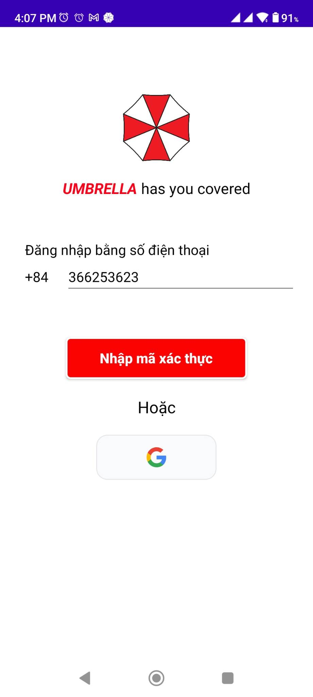

<h3 align="center">

***Màn hình đăng nhập***
</h3>

Ứng dụng hỗ trợ người dùng hai tùy chọn để đăng nhập vào chương trình, bao gồm:

1. Đăng nhập bằng số điện thoại di động với mã OTP

2. Đăng nhập bằng tài khoản Google 

## [**3. Home**](#3-home)

    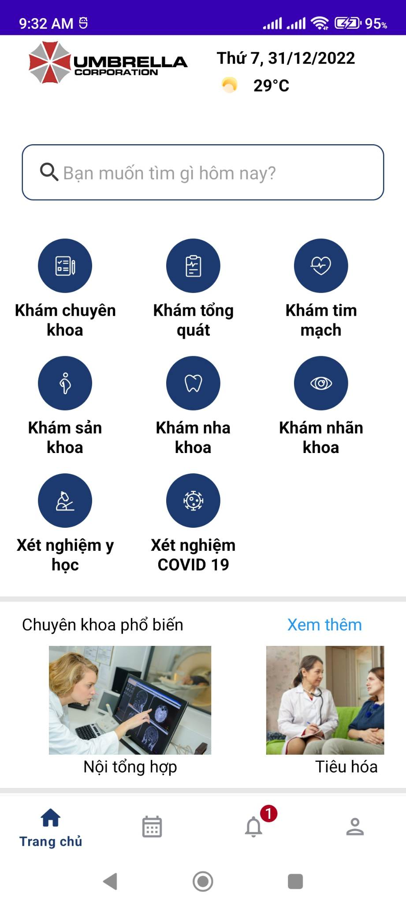
    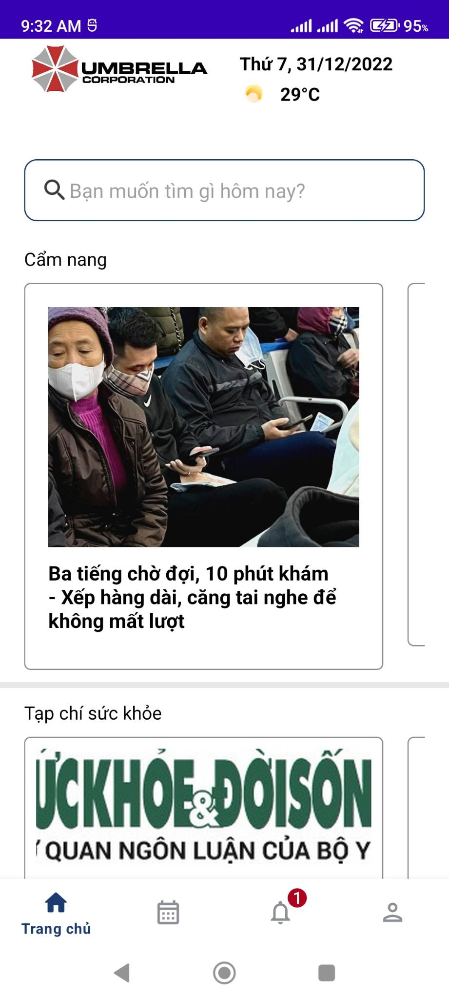
    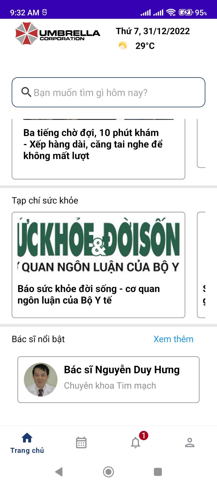

<h3 align="center">

***Màn hình Home➡***
</h3>

Màn hình Home với hình ảnh minh họa bên từ trái qua là trình tự nội dung mà chúng ta sẽ nhìn thấy trên màn hình khi vuốt từ trên xuống dưới

Màn hình này bao gồm các thành phần như sau:

1. Logo
   
2. Ngày giờ 
   
3. Nhiệt độ  tại khu vực hiện tại ( OpenWeatherMap.org )

4. Thanh tìm kiếm

5. Các nút tắt để Tạo lịch hẹn với bác sĩ

6. Danh mục chuyên khoa phổ biến để hiển thị các chuyên khoa của các bác sĩ

7. Danh mục Cẩm Nang để thể hiện các bài viết

8. Danh mục tạp chí sức khỏe Hiển thị các đường dẫn tới các trang web chính thống liên quan tới sức khỏe và y tế

9. Danh mục bác sĩ nổi bật được sử dụng để hiển thị các bác sĩ đang làm việc trong bệnh viện 

10. Thanh điều hướng với 4 menu chính: Trang chủ 🏠, lịch hẹn 📆, thông báo 🔔 và cá nhân😀

## [**4. Appointment**](#4-appointment)

    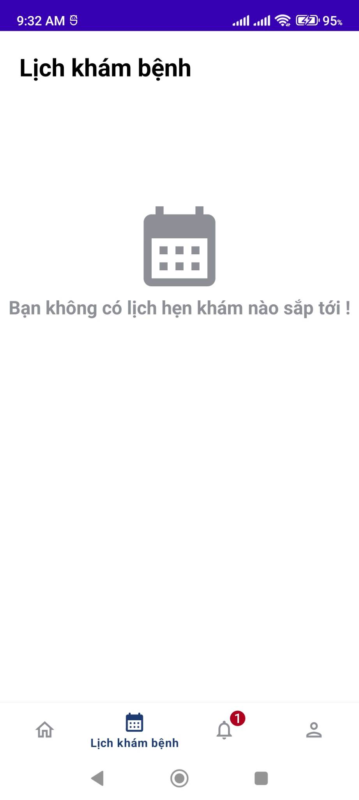
    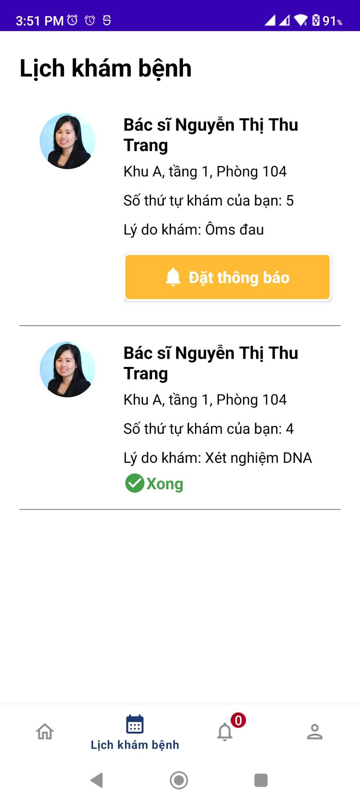

<h3 align="center">

***Màn hình lịch hẹn bên phải là khi chưa có lịch hẹn và bên trái là khi đang có lịch khám với bác sĩ***
</h3>

Màn hình này sẽ hiển thị thông tin về bác sĩ, phòng khám, lý do mà bệnh nhân đăng ký khám,.....

Ngoài ra, nút **Đặt lịch hẹn** có tác dụng sẽ nhắc thông báo khi mà lượt khám của bệnh nhân sắp đến bằng cách cứ mỗi 45 giây ứng dụng sẽ gửi một HTTP Request lên hệ thống để tự động cập nhật danh sách khám bệnh hiện tại.

    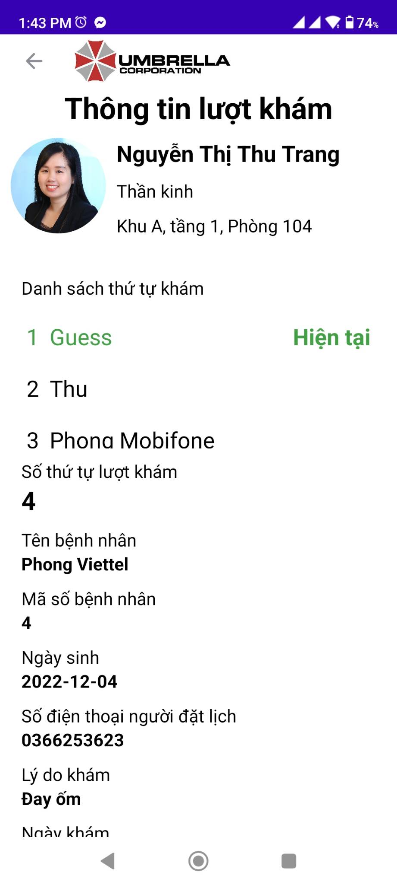
    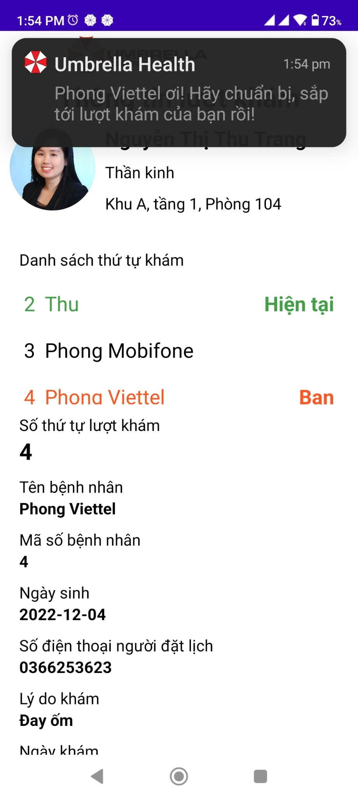

<h3 align="center">

***Khi đến giờ khám của bệnh nhân ứng dụng sẽ sẽ phát thông báo và nhạc chuông để nhắc nhở người dùng***
</h3>

## [**5. Treatment & Record**](#5-treatment--record)

    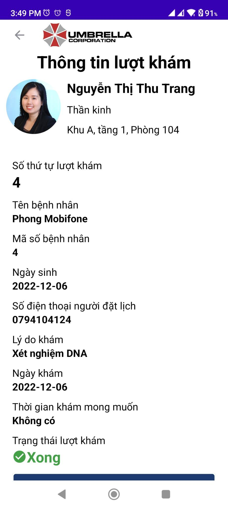
    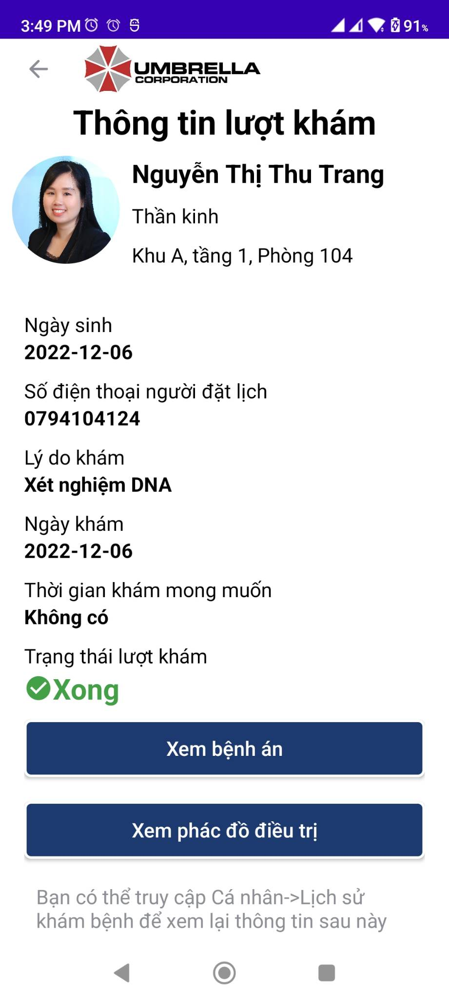

<h3 align="center">

***Sau khi lập khám hoàn tất bệnh nhân có thể xem lại phác đồ điều trị và bệnh án***
</h3>

Khám hoàn tất bệnh nhân có thể mở ứng dụng để xem lại phác đồ điều trị và bệnh án của mình tương ứng với hai nút chức năng

1. Xem bệnh án
2. Xem phác đồ điều trị 

    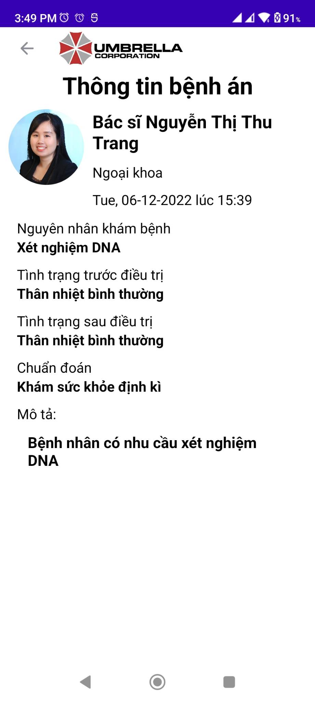

<h3 align="center">

***Màn hình xem bệnh án***
</h3>

Người dùng có thể xem phác đồ điều trị chị và có thể tự tạo nhắc nhở thực hiện toa thuốc theo hướng dẫn của bác sĩ

    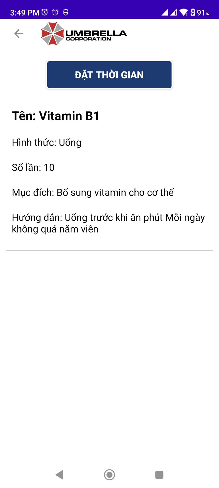

<h3 align="center">

***Xem phác đồ điều trị với nút Đặt nhắc nhở***
</h3>

## [**6. Reminder**](#6-reminder)

Khi người dùng nhấn vào nút **Đặt nhắc nhở**, màn hình sẽ hiện thị như hình minh họa bên dưới & người dùng có thể Tạo nhắc nhở ở tùy theo theo chỉ dẫn của bác sĩ 

    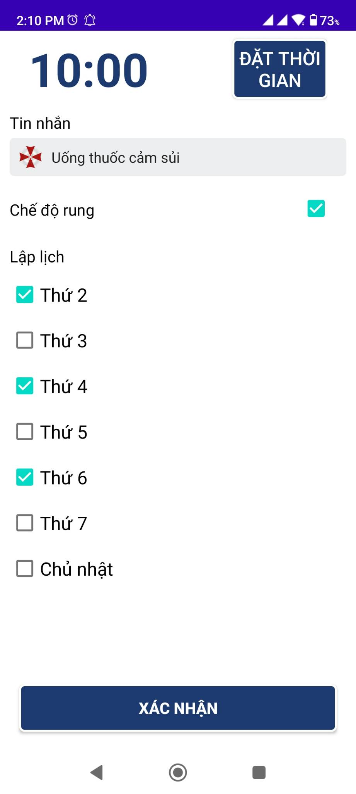

<h3 align="center">

***Người dùng có thể chủ động đặt thời gian nhắc nhở 📅***
</h3>

Khi ấn vào nút **Xác nhận**,  ứng dụng sẽ tìm tới các ứng dụng trong hệ thống để tạo nhắc nhở. Nếu có nhiều hơn một ứng dụng có thể đáp ứng được yêu cầu thì hệ chương trình sẽ hiển thị ra một cửa sổ để người dùng lựa chọn  

    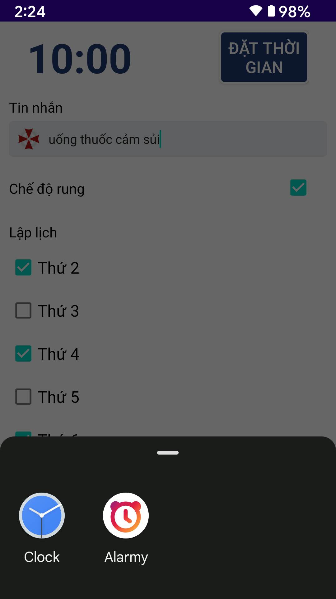

<h3 align="center">

***Có thể lựa chọn ứng dụng 🔔🔔***
</h3>

Kho ứng dụng đồng hồ trên các mẫu điện thoại là khác nhau nên giao diện hiển thị sẽ khác nhau đôi chút nhưng chức năng thì sẽ giống nhau 

    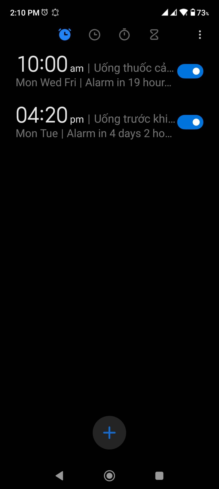
    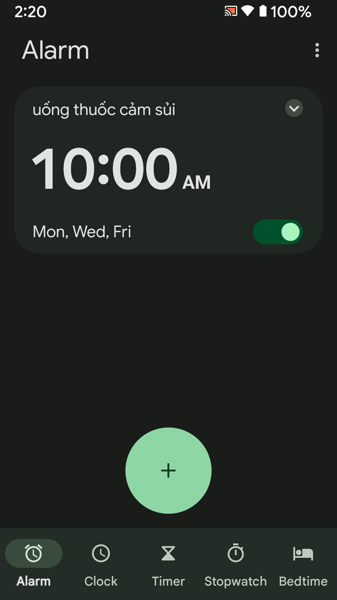

<h3 align="center">

***Giao diện khác nhau nhưng chức năng sẽ giống nhau***
</h3>

## [**7. Booking**](#7-booking)

Như đã giới thiệu ở phần đầu tiên của tài liệu này chức năng đặt lịch hẹn không nhằm mục đích là để đặt thời gian riêng với bác sĩ mà chỉ đơn thuần là cung cấp thông tin bệnh lý. Nhắm tới 2 mục đích chính:

1. Để rút ngắn thời gian đăng ký khám bệnh
   
2. Để bác sĩ có thể chẩn đoán bệnh nhanh hơn trong quá trình khám bệnh
   
Người bệnh sẽ chỉ nhận được số số thứ tự khám khi bệnh nhân đã có mặt tại bệnh viện 

Khi đặt lịch khám sử dụng có thể để chọn nguyên nhân khám bệnh phù hợp 

    

<h3 align="center">

***Lựa chọn nguyên nhân khám bệnh phù hợp***
</h3>

Ở bước này người sử dụng có thể để chọn nguyên nhân khám bệnh phù hợp và tiến hành đăng ký luôn.

    

<h3 align="center">

***Lựa chọn nguyên nhân khám bệnh và tiến hành đăng ký bằng cách ấn vào nút Tạo lịch hẹn***
</h3>

Người dùng có thể xem thông tin của bác sỹ và tiến hành đặt lịch khám với bác sĩ bằng cách ấn vào nút đặt lịch hẹn 

    

<h3 align="center">

***Chỉ định luôn bác sĩ và tiến hành đăng ký bằng cách ấn vào nút Tạo lịch hẹn***
</h3>

Sau khi chọn xong người dùng sẽ nhập các thông tin cá nhân cần thiết để tiến hành đăng ký

    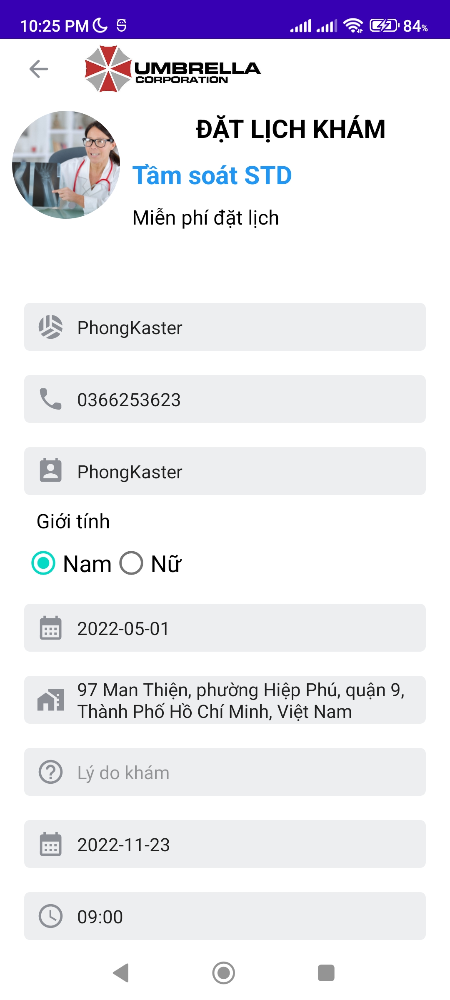
    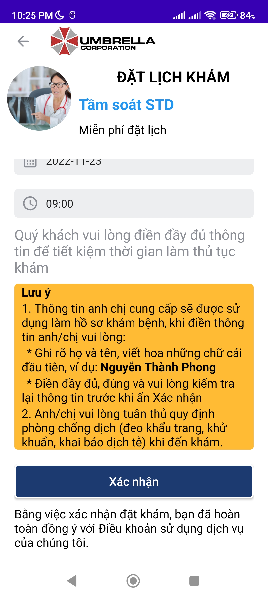

<h3 align="center">

***Đặt hẹn chỉ nhà nhằm mục đích rút ngắn thời gian đăng ký và chẳng khám bệnh bác sĩ. Không phải là đặt trước thời gian khám bệnh***
</h3>

Sau quá trình đăng ký thông tin bên trên người dùng có thể đăng tải những hình ảnh về toa thuốc, chẩn đoán của bác sĩ,....... mà trước đây đã đã trải qua nhưng bệnh vẫn chưa khỏi. Điều này sẽ giúp cho bác sĩ có thể biết được những liệu pháp mà bệnh nhân đã sử dụng & kê ra những đơn thuốc hiệu quả hơn

    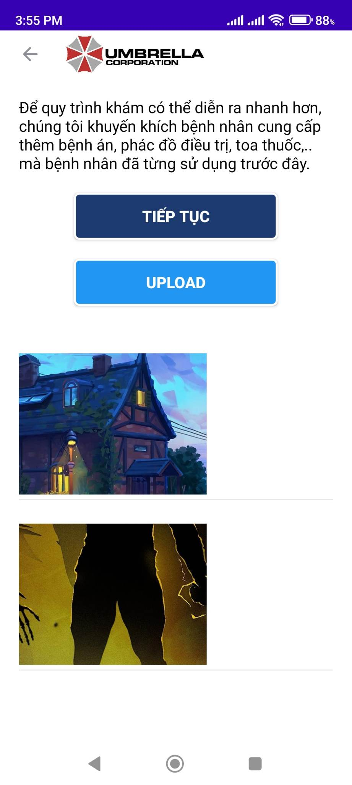

<h3 align="center">

***Để xóa một tấm hình, chúng ta có thể vuốt tay từ bên phải qua trái ⬅***
</h3>

Sau khi đăng nhập thành công người sử dụng có thể lựa chọn một bạn có thể chuyển về trang chủ hay họ có thể chuyển tới trang hướng dẫn đi khám 

    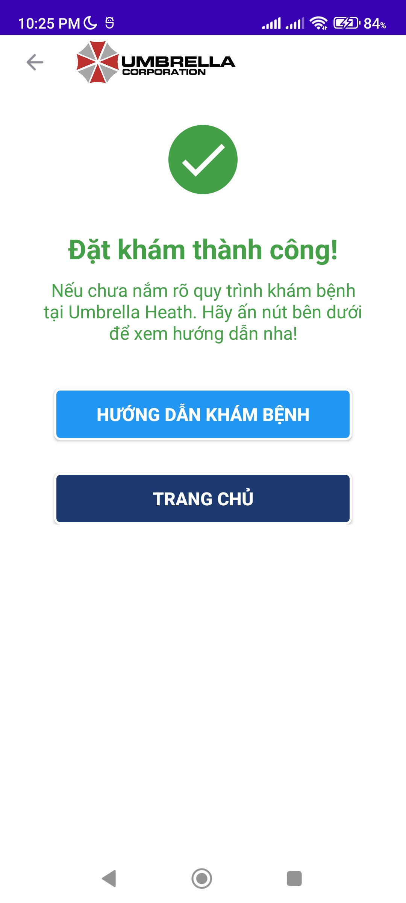

<h3 align="center">

***Trở về màn hình chính hoặc xem hướng dẫn đi khám***
</h3>

## [**8. Notification**](#8-notification)

Ứng dụng có thể thông báo với người dùng qua 2 hình thức, bao gồm:
- Thông báo bằng thông báo hệ thống của Android System
- Thông báo bằng bằng mục thông báo dành riêng trong ứng dụng 

    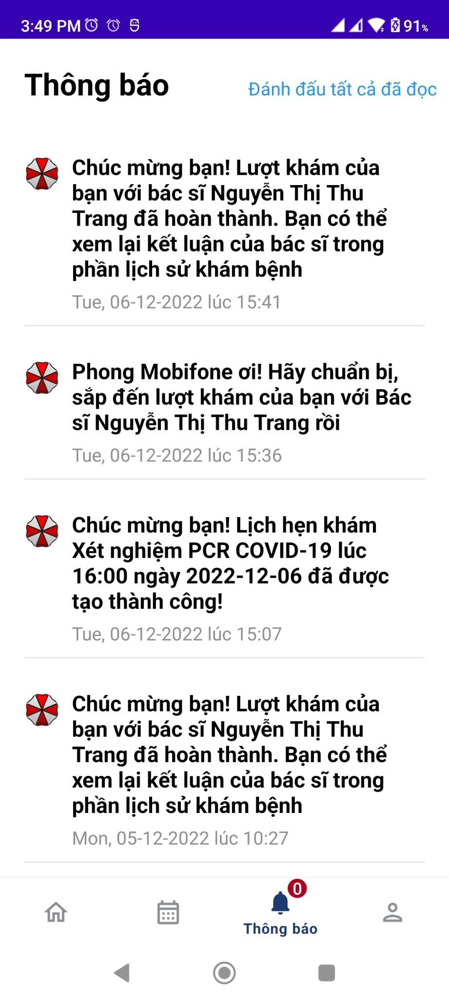
    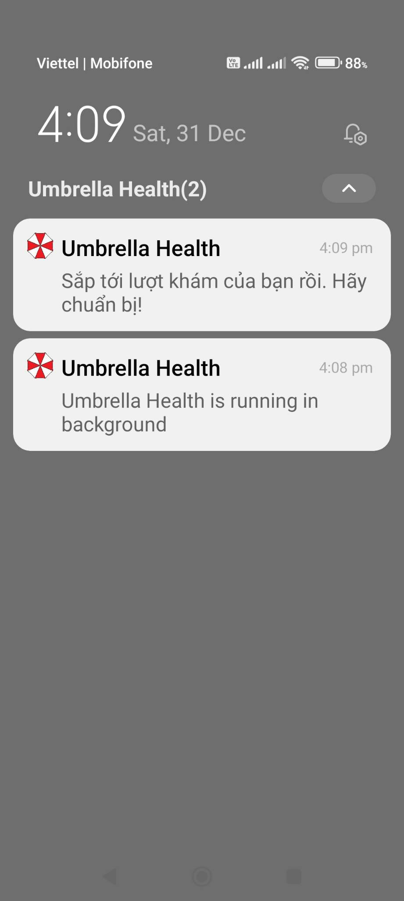

<h3 align="center">

***Thông báo được hiển thị trực quan để dễ theo dõi***
</h3>

# [**Minor Features**](#minor-features)

Phần này mình sẽ giới thiệu với các tính năng nhỏ mang tinh thần là hỗ trợ, nâng cao trải nghiệm của người sử dụng.

    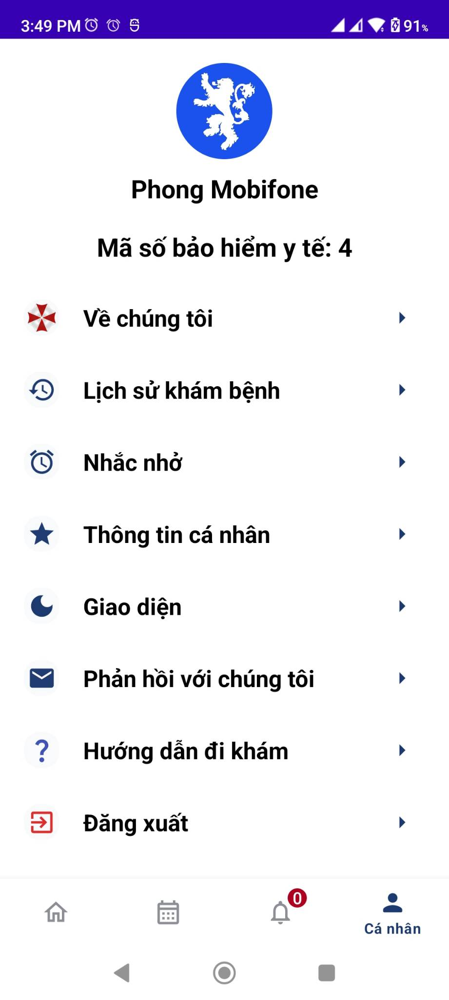

<h3 align="center">

***Các tính năng nhỏ sẽ được nằm tập hợp trong danh mục Cá nhân - menu cuối cùng trong thanh điều hướng***
</h3>

## [**1. About Us**](#1-about-us)

Chức năng này được sử dụng ảnh để giới thiệu với người dùng về ứng dụng. Khi người dùng Nhấn vào vì chọn tướng nhứng thì ứng dụng sẽ mở một Web View dẫn tới đường link YouTube 

    

<h3 align="center">

***Ứng dụng mở một video YouTube bằng WebView***
</h3>

## [**2. Appointment history & Booking history**](#2-appointment-history--booking-history)

Lịch sử khám bệnh & Lịch sử đặt lịch hẹn là 2 phần danh mục được sử dụng để giúp người dùng có thể xem lại lịch sử khám bệnh. Hỗ trợ người dùng có thể xem lại các phác đồ điều trị & chẩn đoán của bác sĩ

    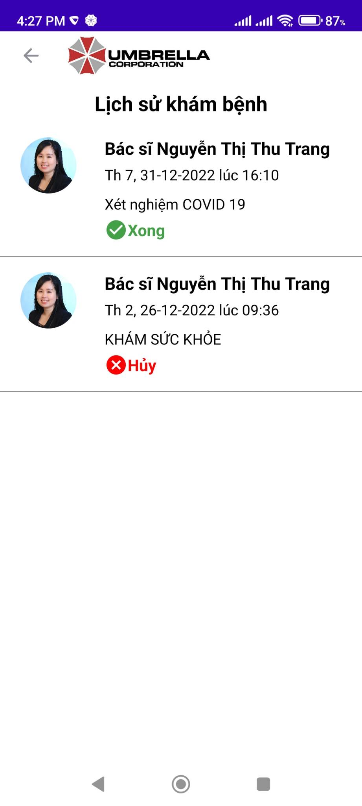
    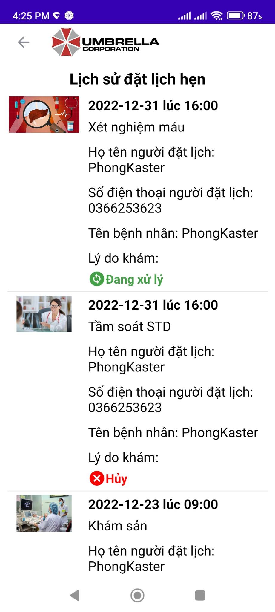

<h3 align="center">

***Xem lại lịch sử khám bệnh và đặt lịch hẹn***
</h3>

## [**3. Reminder**](#3-reminder)

Ngoài việc tạo nhắc nhở khi mở phần Xem phác đồ điều trị, người dùng cũng có thể chủ động ấn vào mục nhắc nhở trên màn hình cá nhân để tự tạo nhắc nhở cho bản thân mình

    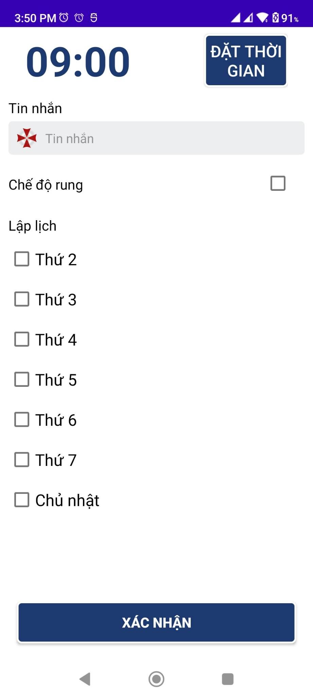

<h3 align="center">

***Tạo nhắc nhở***
</h3>

## [**4. Personal Information**](#4-personal-information)

Chức năng này được sử dụng để cập nhật lại thông tin cá nhân Bao gồm
- Cập nhật ảnh đại diện
- Cập nhật thông tin cá nhân: tên, tuổi, địa chỉ......

    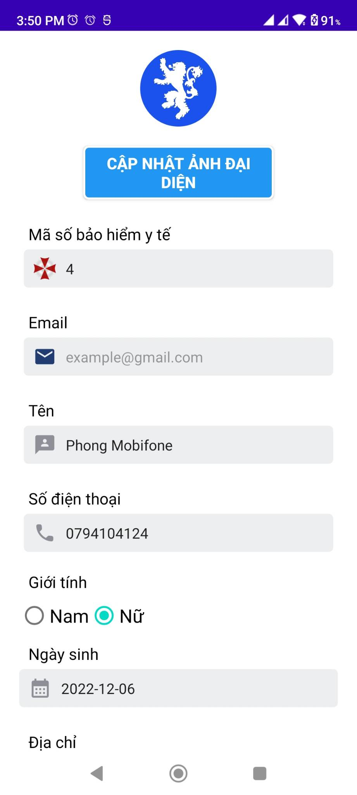
    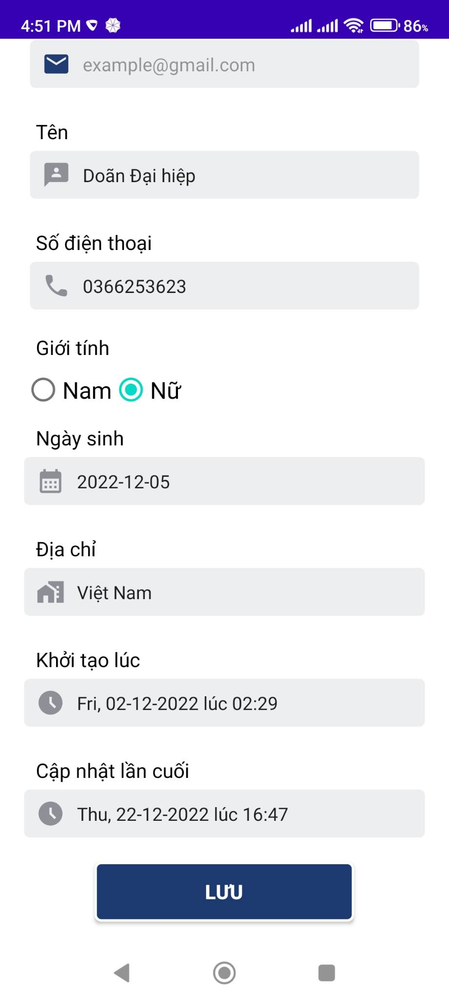

<h3 align="center">

***Cập nhật thông tin cá nhân🤷‍♂️***
</h3>

## [**5. Dark Mode**](#5-dark-mode)

Hỗ trợ chế độ ban đêm và người sử dụng có thể chủ động bật tắt vì theo ý muốn 

    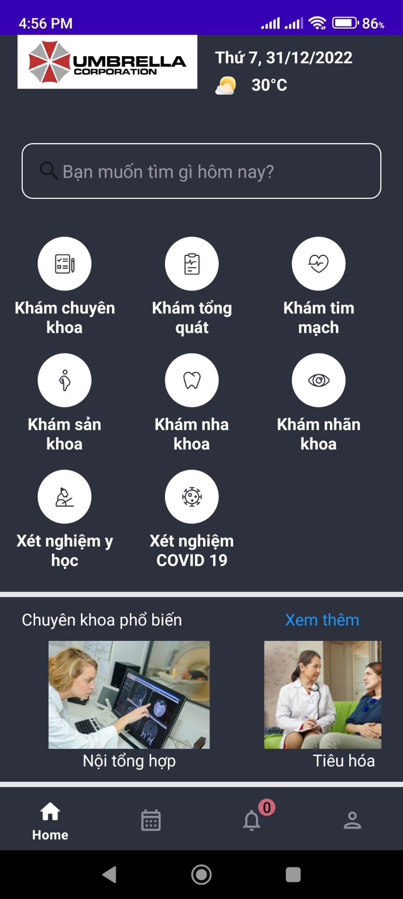
    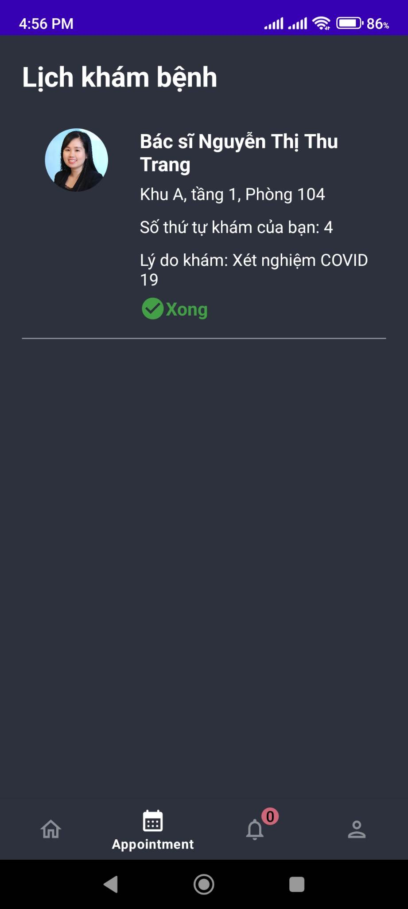
    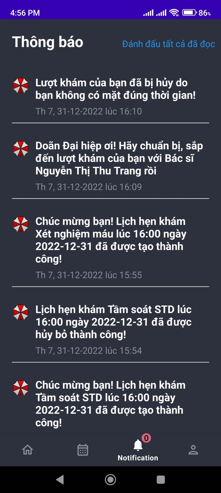
    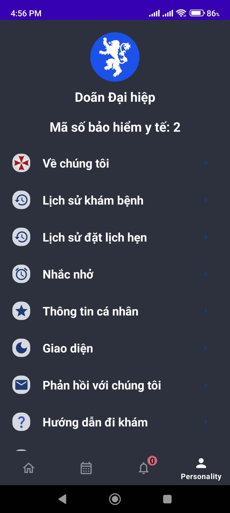

    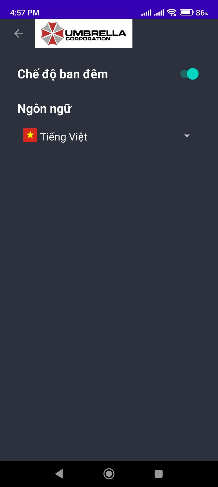

<h3 align="center">

***Chế độ ban đêm bật tắt theo ý muốn🌑🌘🌓🌒🌚***
</h3>

## [**6. Email**](#6-email)

**Phản hồi với chúng tôi** là tính năng giúp cho người dùng có thể soạn email để gửi những khiếu nại, góp ý về cho nhà phát triển ứng dụng

    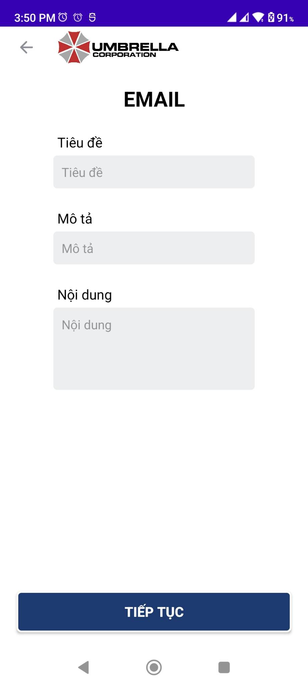
    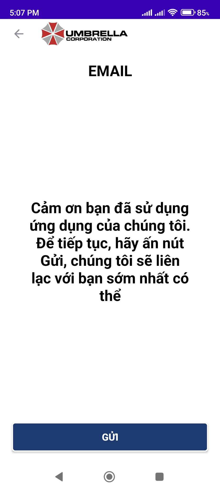
    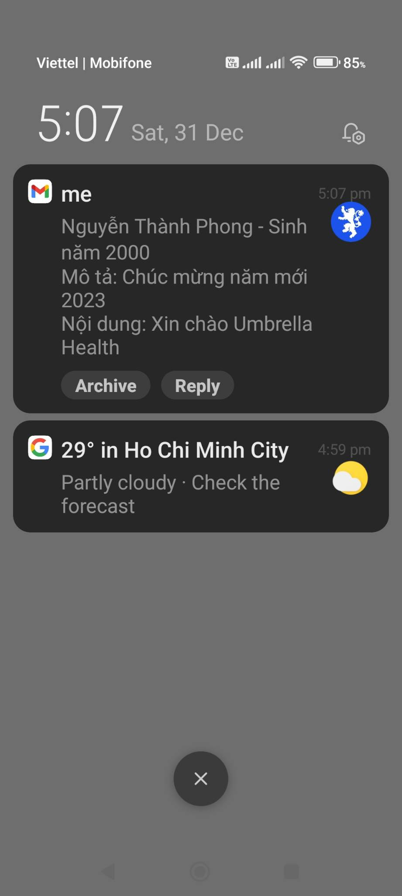

<h3 align="center">

***Gửi email để liên lạc với bộ phận chăm sóc khách hàng🚻***
</h3>

## [**7. Support Different    Languages**](#7-support-different-languages)

Ứng dụng này hỗ trợ tổng cộng 3 ngôn ngữ bao gồm: 

-  Tiếng Anh 
  
-  Tiếng Đức 
  
-  Tiếng Việt 

    
    
    

<h3 align="center">

***Từ trái qua phải: tiếng Anh, tiếng Đức & tiếng Việt***
</h3>

## [**8. Navigation with Google Map**](#8-navigation-with-google-map)

Người dùng nếu như không nắm được lộ trình tới bệnh viện thì có thể chọn vào mục hướng dẫn đi khám để mở ra bản đồ và lộ trình di chuyển bằng ứng dụng Google Maps 
 

    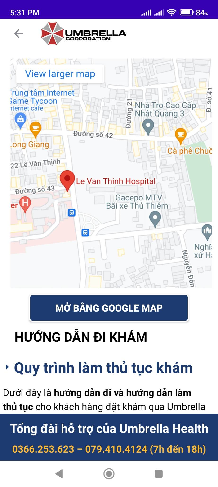
    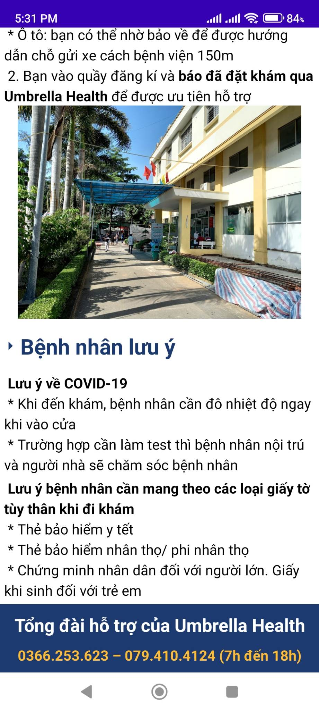

<h3 align="center">

***Xem bản đồ và hướng dẫn đi khám trực tiếp trên di động***
</h3>

Người dùng có thể ấn vào nút `Mở bằng Google Map` để để điều hướng tới ứng dụng Google Maps trên điện thoại di động 

    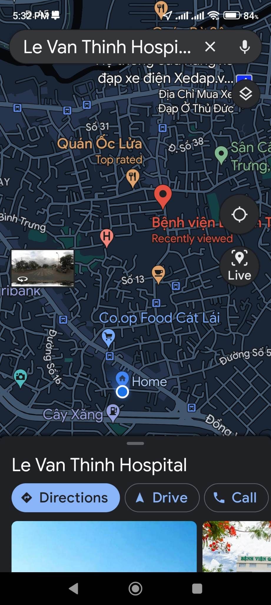

<h3 align="center">

***Ứng dụng Google Maps sẽ dẫn đường tới bệnh viện***
</h3>

## [**9. Pop-up when clicking Back button**](#pop-up-when-clicking-back-button)

Nếu người dùng ở màn hình chính mà vô tình hoặc muốn thoát ứng dụng. Một cửa sổ sẽ hiển thị lên 
để xác nhận xem người dùng có muốn thoát chương trình hay không ?

    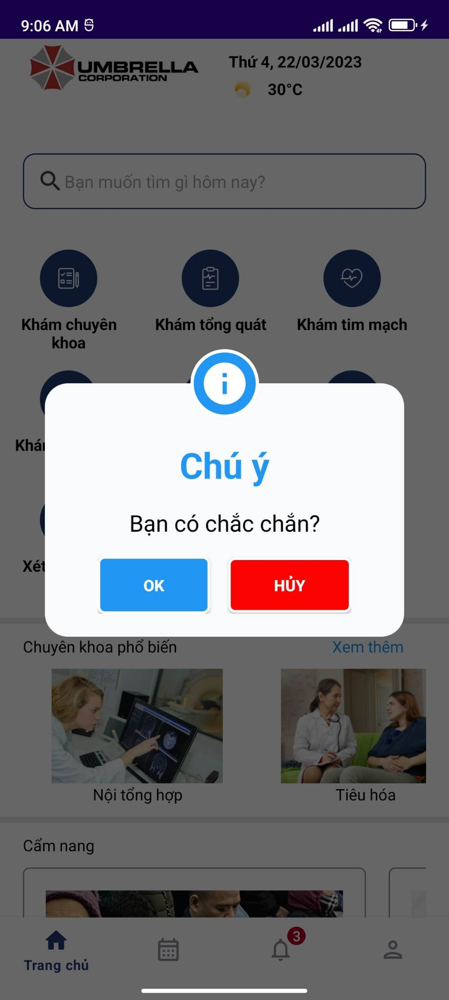

<h3 align="center">

***Cửa số hiển thị lên để xác nhận xem người dùng có thực sự muốn thoát chương trình ✔ ❌***
</h3>

# [**Post Script**](#post-script)

Phía trên là toàn bộ các chức năng và giao diện mà mình đã thực hiện trong trong đồ án tốt nghiệp này. 

Có thể nói tất cả những tính năng kết kể trên là toàn bộ những tính năng phức tạp nhất mà mình có thể thực hiện được ở Đồ án tốt nghiệp đại học này - Ngày 26-12-2022 - ngày Lễ bảo vệ đồ án tốt nghiệp của mình . 

Phong hi vọng phần chia sẻ ở phía trên sẽ ít nhiều đem lại hữu ích cho các bạn.

Hôm nay là thứ 7, ngày 31-12-2022 - tức ngày cuối cùng của năm 2022 theo dương lịch. Phong xin gửi lời chúc những bạn đang đọc được những dòng lưu bút này một năm 2023 nhiều niềm vui, hạnh phúc bên người thân và gia đình🎈🎆🎇🧨✨🎉🎊🎡

    

<h3 align="center">

***CHÚC MỪNG NĂM MỚI 2023***
</h3>

# [**Made with 💘 and Android**](#made-with-love-and-Android)